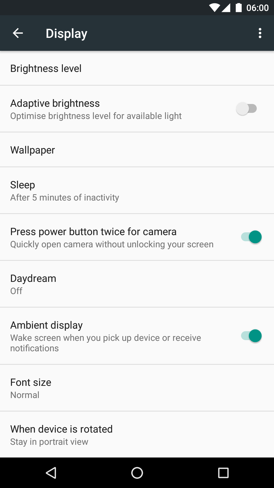

Enable Ambient Display - Xposed
===============================

Easy Xposed module for Lollipop which add Ambient Display

 

Credits
-------

[XDA-forum](http://forum.xda-developers.com/google-nexus-5/themes-apps/how-to-add-ambient-display-settings-t2942838)

LICENSE
-------

[MIT License](http://opensource.org/licenses/MIT)
